# PantryOps

Inventory-aware cooking operations.

## Index

- [Core Concepts](#core-concepts)
- [Golden Flow](#golden-flow)
- [Tech Stack](#tech-stack)
- [Quick Start (Development)](#quick-start-development)
- [Domain Separation](#domain-separation)
- [Key Features](#key-features)
- [OpenFoodFacts Attribution and License](#openfoodfacts-attribution-and-license)
- [Screenshots](#screenshots)
- [Non-Goals](#non-goals)
- [Project Status](#project-status)
- [Documentation](#documentation)
- [Contributing](#contributing)
- [Security](#security)

## Core Concepts

- Recipes are universal: they use ingredient categories, not specific SKUs.
- Cooking is a stock operation: inventory is consumed and tracked through transactions.
- Preview before commit: you can inspect the consumption plan before applying changes.
- FEFO-first logic: items expiring sooner are consumed first.

## Golden Flow

1. Add products to pantry stock with expiration dates.
2. Create recipes with ingredient categories.
3. Get daily cooking suggestions based on real stock.
4. Preview the consumption plan.
5. Confirm cooking and update stock with traceability.

## Tech Stack

- Backend: Fastify + Prisma + TypeScript
- Frontend: Vite + React + TypeScript
- Database: PostgreSQL
- Runtime: Bun

## Quick Start (Development)

### Prerequisites

- Bun
- Docker (for PostgreSQL)

### 1. Start database

```bash
docker-compose up -d
```

### 2. Configure backend environment

Copy the template:

```bash
cp backend/.env.example backend/.env
```

PowerShell equivalent:

```powershell
Copy-Item backend/.env.example backend/.env
```

For production, use a strong and private value for `JWT_SECRET`.

### 3. Start backend

```bash
cd backend
bun install
bun run db:push
bun run db:seed
bun run dev
```

Backend health endpoint:

```text
http://localhost:3001/health
```

### 4. Start frontend

```bash
cd frontend
bun install
bun run dev
```

Frontend dev URL:

```text
http://localhost:5173
```

### 5. Optional: Seed a screenshot-ready demo household

From `backend/`:

```bash
bun run db:seed:screenshots
```

This script is non-destructive and idempotent for the demo target:

- reuses a deterministic demo account/household if already present
- creates and enriches data for fuller screenshots (stock, recipes, shopping states)
- avoids mass deletes and does not touch other households

Default demo credentials:

- email: `demo.screenshots@pantryops.local`
- password: `DemoScreenshots123!`

Optional flags:

- `--size=compact|medium|large` (default: `medium`)
- `--household-name="PantryOps Demo Screenshots"`
- `--email=...`
- `--password=...`

## Domain Separation

- `recipes`: static recipe metadata
- `stock`: physical inventory state (lots, balances, transactions)
- `suggestions`: decision support and preview logic
- `queries`: read-only aggregations

## Key Features

- Stock management with expiration dates
- FEFO-based consumption
- Cooking preview before commit
- Auditable stock transactions
- Stock-driven shopping suggestions
- Barcode scanning via OpenFoodFacts

## OpenFoodFacts Attribution and License

PantryOps uses OpenFoodFacts data for barcode-based product lookup.

- Terms of use and reuse: https://world.openfoodfacts.org/terms-of-use
- API documentation: https://openfoodfacts.github.io/api-documentation/
- API introduction and license notes: https://openfoodfacts.github.io/openfoodfacts-server/api/

Key compliance points:

- OpenFoodFacts database is licensed under ODbL (attribution + share-alike obligations).
- A custom `User-Agent` is required for API calls.
- Endpoint-level rate limits apply.
- Register your app usage: https://world.openfoodfacts.org/api/v2/app/get

## Screenshots

Current UI snapshots:

<p>
  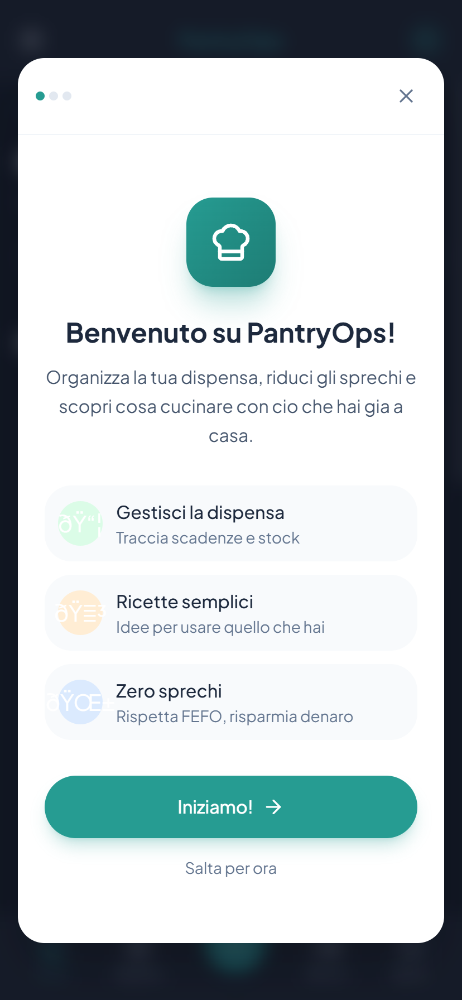
  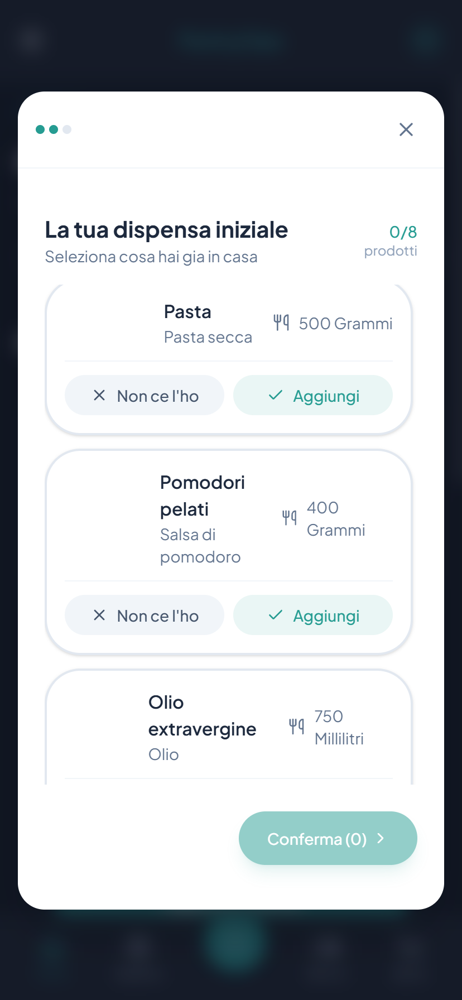
  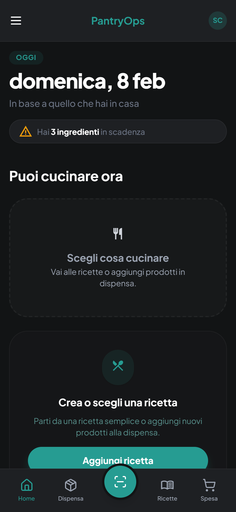
  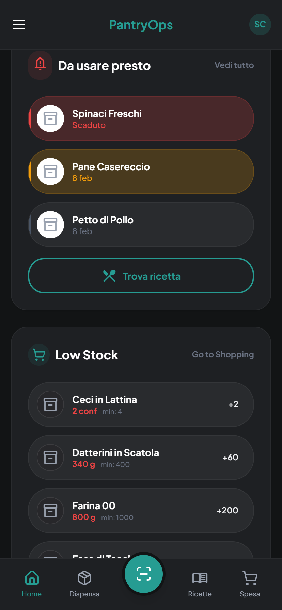
  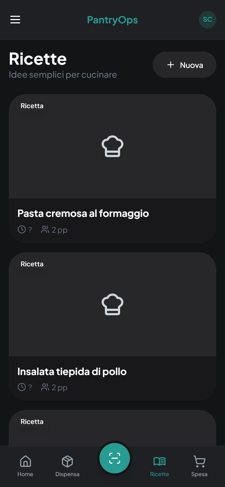
  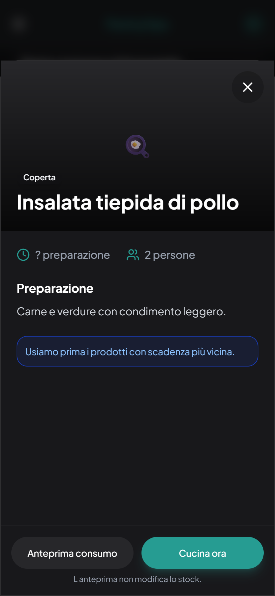
  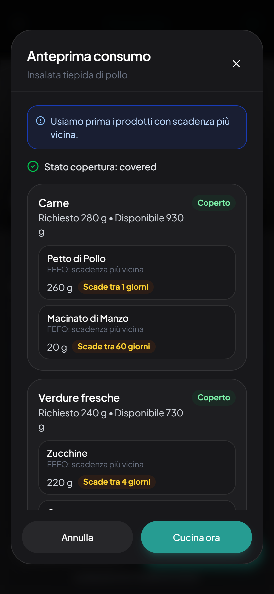
</p>

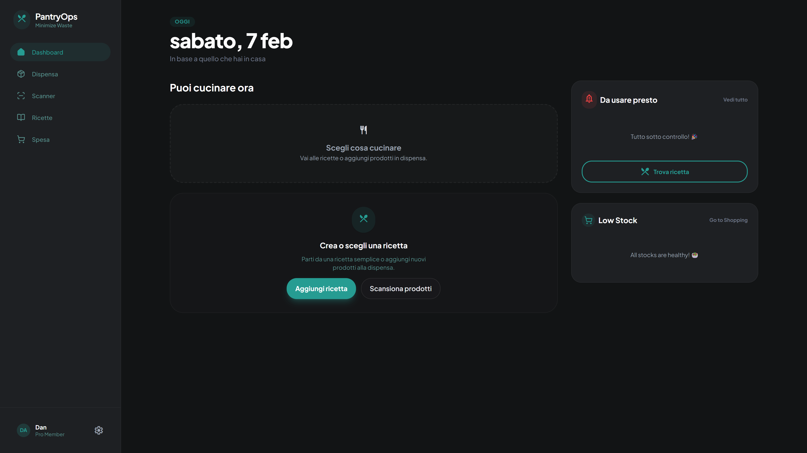
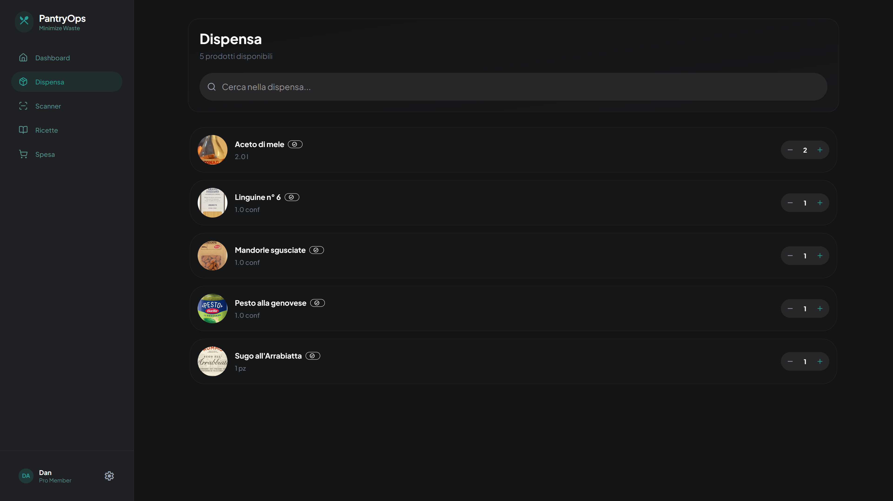
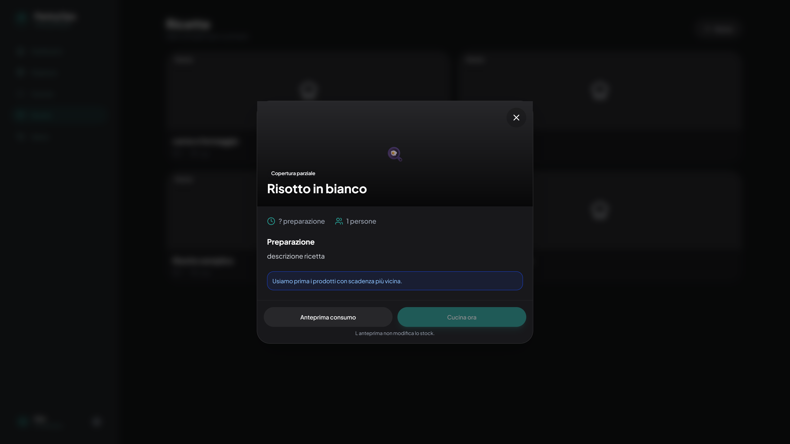
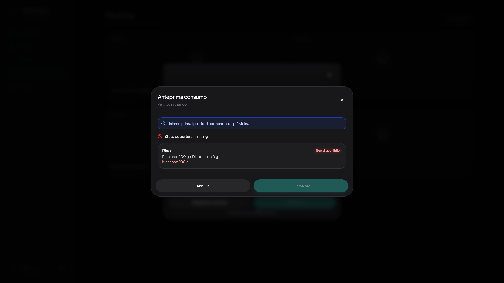

## Non-Goals

- Generic recipe collection app
- Calorie/nutrition tracker
- Polished consumer product focus over domain correctness

## Project Status

Early-stage open source project. Core inventory and recipe flows are stable, with ongoing UX iteration.

## Documentation

- `pantryops_project_documentation_versioned.md`
- `CHANGELOG.md`
- `NOTICE.md`
- `CONTRIBUTING.md`
- `SECURITY.md`
- `SUPPORT.md`

## Contributing

Contributions are welcome. Start with `CONTRIBUTING.md`.

Current priorities:

- Improve the golden flow
- Reduce cognitive load
- Keep decision logic explainable

## Security

Please report vulnerabilities following `SECURITY.md`.
